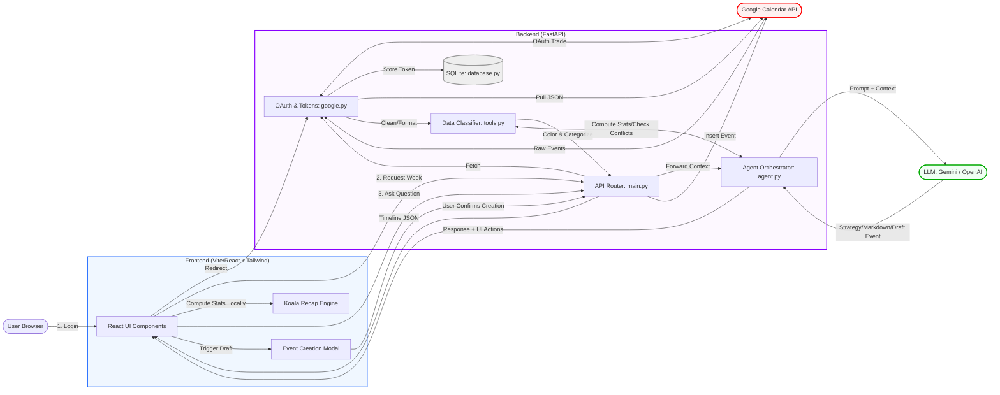

# Co-Calendar - System Architecture

This diagram illustrates the clean flow of data between the User, Frontend, Backend, Google Calendar, and LLMs. It is organized into four core pipelines: **Authentication**, **Calendar Data sync**, **AI Assistant logic**, and **Event Creation (Human-in-the-loop)**.

## Core Pipelines

1. **Authentication Flow (OAuth)**: The User initiates a login, triggering the Google OAuth flow in `google.py`. Tokens (Access & Refresh) are stored securely in the local SQLite database (`database.py`) to persist the session securely.
2. **Event Data Sync & Recap Stats**: The Frontend requests events for the loaded week. The Backend retrieves raw JSON from Google (`google.py`), runs them through the classifier (`tools.py`) to assign contextual tags (Meeting, Focus, Shared), and returns formatted data. Client-side, the **Koala Recap Engine** securely maps these events locally to calculate "Weekly Wrapped" dashboard stats natively in the browser timezone.
3. **AI Chat Engine (`agent.py`)**: When a user asks a question:
    * The **Agent Orchestrator** detects the functional intent.
    * It calls **Stats Tools** to compute actual numbers locally.
    * It builds a strict, grounded System Prompt combined with the local context and fires it to the **LLM**.
    * If the intent is `create_event_request`, the Agent bundles the drafted metadata securely inside a `ui_actions.open_create_event_modal` boolean.
4. **Event Creation (Human-in-the-Loop)**: The AI is restricted from writing to the DB directly. When a draft is returned by the LLM, the frontend safely intercepts the payload, mounting the **CreateEventModal**. Execution (writing to GAPI) strictly requires the user to review the fields and hit "Confirm".
