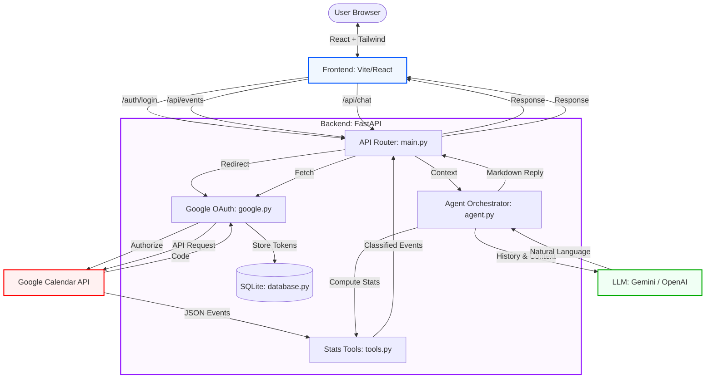

# Calendar Copilot - System Architecture

This diagram illustrates the flow of data between the user, the React frontend, the FastAPI backend, and external services like Google Calendar and LLMs.

## Flow Description

1.  **Authentication**: The User initiates a login, triggering the Google OAuth flow. Tokens (Access & Refresh) are stored in the local SQLite database to persist the session.
2.  **Event Visualization**: The Frontend requests events for the current week. The Backend retrieves them from Google, runs them through the `tools.py` classifier to assign categories (Meeting, Focus, etc.) and pastel colors, and returns them to the React Timeline.
3.  **Chat Interaction**: When a user asks a question (e.g., "How much time did I spend in meetings?"):
    *   The **Agent Orchestrator** detects the intent.
    *   It calls **Stats Tools** to get the actual quantitative data.
    *   It passes the user's question + the calculated data to the **LLM**.
    *   The LLM generates a clear, concise bullet-point strategy.
    *   If no LLM key exists, a **Rule-Based Fallback** provides a deterministic response using the same calculated data.
