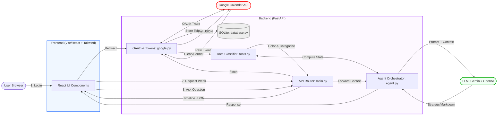

# Co-Calendar - System Architecture

This diagram illustrates the clean flow of data between the User, Frontend, Backend, Google Calendar, and LLMs. It is organized into three core pipelines: **Authentication**, **Calendar Data sync**, and **AI Assistant logic**.

## Core Pipelines

1. **Authentication Flow (OAuth)**: The User initiates a login, triggering the Google OAuth flow in `google.py`. Tokens (Access & Refresh) are stored securely in the local SQLite database (`database.py`) to persist the session securely.
2. **Event Data Sync**: The Frontend requests events for the loaded week. The Backend retrieves raw JSON from Google (`google.py`), runs them through the classifier (`tools.py`) to assign contextual tags (Meeting, Focus, Shared) and exact pastel color hexes, and returns formatted data to React.
3. **AI Chat Engine (`agent.py`)**: When a user asks a question:
    * The **Agent Orchestrator** detects the functional intent.
    * It calls **Stats Tools** to compute actual numbers locally (preventing LLM hallucinations).
    * It builds a strict, grounded System Prompt combined with the local context and fires it to the **LLM**.
    * If an API Key is missing or strictly fails, a local **Rule-Based Fallback** replies with the deterministic math variables.
